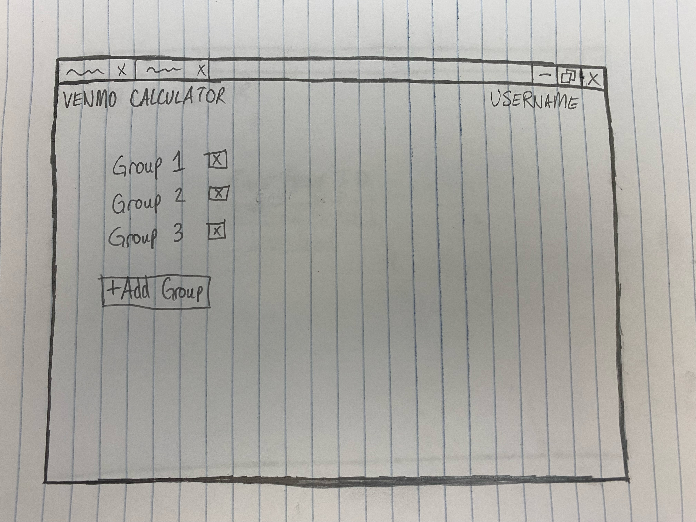

# Startup
Startup application for BYU CS 260

## Elevator Pitch
The Super Bowl is coming up! One friend brings the wings, one friend brings the chips and salsa, and others bring other things. But wait, wings are way more expensive than simple chips and salsa. Shouldn't everyone contribute equally to the gathering? But who needs to send whom how much money? It's such a pain to figure that out, especially when you are throwing the biggest Super Bowl party in Provo! With the "Venmo Calculator", you can simply create a group with your friends, enter in how much you spent, and let the website tell you how much money you need to send to each person. It's that simple!

## Key Features
#### HTML
Uses HTML to create a structure of each aspect of the application. There will be three pages. The first one will be to login. The second one will be to select a group to view/to create a new group. The third one will display the group information (how much the user owes each person in the group).
#### CSS
Uses CSS to make the elements on the pages look good using good color choices and dynamic screen sizes.
#### JavaScript
Provides the logic behind the calculator, logging in, and creating groups. Also allows users to enter the amount they have spent. Also provides the ability for dynamic views like the list of people.
#### Web Service
Backend service with endpoints for:

- Login verification
- Group retrieval
- Creating groups
- Amount retrieval within group
- Entering amount spent by user
#### Authentication
As users log in, their credentials will be authenticated, then their username will display in the upper right corner throughout their session.
#### Database Data
Store users, groups, and amounts spent within group.
#### WebSocket Data
As a user enters the amount they have spent, it will populate in the group for other users. 

## Wireframe Sketches
.jpeg>)

.jpeg>)